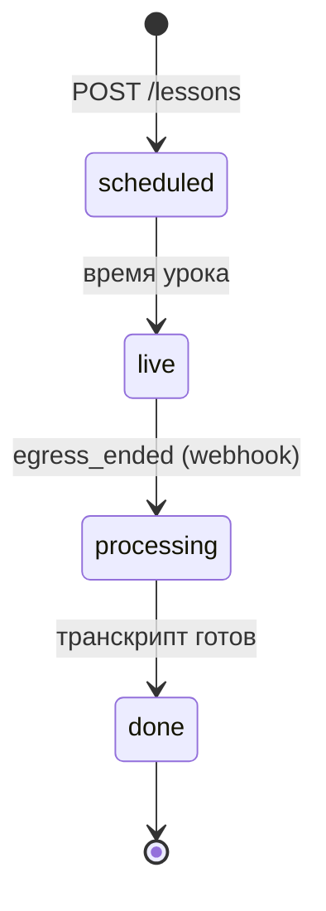

# Поток: жизненный цикл урока

> Центральный сценарий платформы. Одна ссылка `/lesson/{id}` ведёт себя
> по-разному в зависимости от состояния (state machine по времени + статусу).

## State machine

| Статус | Что показывает `/lesson/{id}` | Этап реализации |
|---|---|---|
| scheduled | материалы, домашка, время; событие уже в календарях | 0 (вид), 1 (календарь) |
| live | кнопка «Войти в класс» (LiveKit), вкладка доски, панель «словарь урока» | 1 (комната), 3 (доска, словарь) |
| processing | «запись обрабатывается» | 1–2 |
| done | плеер записи + транскрипт по спикерам + словарь урока + материалы | 1 (плеер), 2 (транскрипт), 3 (словарь) |

## Шаги

1. Преподаватель создаёт урок (группа, дата, время) → `POST /lessons`. *(этап 0)*
2. worker создаёт событие в Google Calendar: `events.insert`,
   `attendees` = email участников, `sendUpdates: all`,
   description = `https://platform/lesson/{id}`. Событие прилетает в личные
   календари студентов автоматически. Перенос → `events.update`,
   отмена → `events.delete`. *(этап 1)*
3. Преподаватель прикрепляет домашку/материалы; до старта страница показывает
   их. *(этап 0)*
4. В момент урока — кнопка «Войти в класс»: api выдаёт LiveKit access token,
   комната `lesson-{id}`. Рядом — вкладка доски
   (`excalidraw?room=lesson-{id}`) и панель «словарь урока»: клики по словам
   из материалов летят в `lesson_term_candidates`. *(этапы 1, 3)*
5. При старте комнаты api запускает LiveKit Egress: room composite →
   `s3://…/recordings/{id}/room.mp4`; экономный вариант — audio-only. *(этап 1)*
6. Урок кончился → webhook `egress_ended` → `status=processing` → worker:
   presigned GET на запись → AssemblyAI (`speaker_labels: true`,
   `language_code: en`, webhook). *(этапы 1–2; на этапе 1, пока ASR нет,
   сразу `done`)*
7. Webhook AssemblyAI → сохраняем `utterances` → рендерим WebVTT (`<v A>…`)
   в S3 → `status=done`. *(этап 2)*
8. **Post-lesson flow (выбор слов).** Преподавателю — чеклист кандидатов:
   клики за урок + текст-элементы из JSON-сцены Excalidraw (`type: "text"`) +
   ручной ввод. Отмеченные → `lesson_terms` → назначение всем/выборочно:
   `user_terms(status=1)` + `srs_cards` (FSRS init; появляется на этапе 4,
   до этого — только user_terms, см. долг D-3). *(этапы 3–4)*
9. Та же ссылка `/lesson/{id}` показывает: плеер записи + скользящий
   транскрипт по спикерам (клик по реплике = seek) + словарь урока +
   материалы. Спикеров A/B/C преподаватель одним селектом маппит на имена
   (`utterances.user_id`). *(этапы 1–3)*

Связано: [../04-api.md](../04-api.md) ·
[../integrations/livekit.md](../integrations/livekit.md) ·
[../integrations/assemblyai.md](../integrations/assemblyai.md) ·
планы [stage-1](../../plans/stage-1-calendar-livekit.md),
[stage-2](../../plans/stage-2-transcripts.md),
[stage-3](../../plans/stage-3-dictionary-whiteboard.md)
