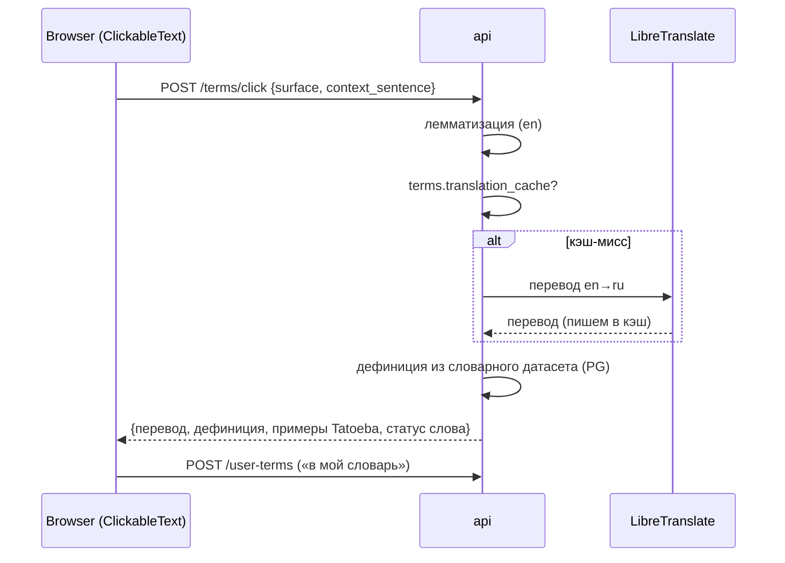

# Поток: клик по слову (везде)

> Работает в любом тексте системы через единый компонент `<ClickableText>`
> (инвариант). Реализуется на этапе 3; примеры Tatoeba и LLM-объяснение
> подключаются на этапе 5 (долги D-1, D-2).

## Последовательность

## Содержимое попапа

- Перевод (кэш → LibreTranslate; порядок источников —
  [../integrations/translation.md](../integrations/translation.md)).
- Дефиниция из локального словарного датасета (kaikki.org / Wiktionary-дампы
  в PG, импорт S3-4).
- 1–2 примера из Tatoeba *(появятся после S5-4 — до этого блок скрыт, долг D-1)*.
- Кнопка «объясни» → LLM с контекстом предложения *(после S5-8, долг D-2)*.
- Кнопка «в мой словарь» → `user_terms(status=1)`; клик на уроке дополнительно
  пишет кандидата в `lesson_term_candidates(source='click')`.

## Раскраска слов

`<ClickableText>` токенизирует текст, лемматизирует токены и красит слова
по `user_terms.status` (1..5: new..known); незнакомые слова визуально
отличимы во всех текстах — материалах, транскриптах, субтитрах, Tatoeba,
сгенерированных текстах.

Связано: [../03-data-model.md](../03-data-model.md) ·
план [stage-3](../../plans/stage-3-dictionary-whiteboard.md)
