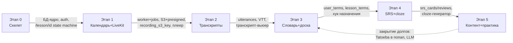

# Flow реализации: конвейер этапов и артефактов

> Как мы идём по этапам 0–5, ничего не теряя между ними.
> Статусы задач — только в [../tasks/INDEX.md](../tasks/INDEX.md).
> Роль и протокол ассистента — [../../CLAUDE.md](../../CLAUDE.md).

## Конвейер артефактов

| Этап | Главный выход | Кто потребляет |
|---|---|---|
| 0 | стенд (compose+TLS), БД-ядро, auth+роли, CRUD уроков, `/lesson/{id}` state machine | все последующие |
| 1 | worker + очередь `jobs`, календарь, LiveKit-комнаты, S3 + presigned, запись урока, плеер, бэкапы | 2 (запись, webhooks), 3 (S3 для досок), 5 (worker для сборщика) |
| 2 | `transcripts`/`utterances`, VTT в S3, транскрипт-вьюер, маппинг спикеров | 3 (тексты для ClickableText), 4 (предложения для cloze) |
| 3 | `<ClickableText>`, terms+переводы+дефиниции, `user_terms`, доска, post-lesson picker | 4 (слова для SRS), 5 (леммы, статусы слов) |
| 4 | FSRS (`srs_cards`/`srs_reviews`), очередь повторений, cloze | 5 («забытые слова» для подбора видео/текстов) |
| 5 | сборщик субтитров + FTS, Tatoeba, LLM-модуль, видео/тексто-практика | закрывает долги этапа 3 (D-1, D-2) |

## Правила работы

1. **Порядок.** Задачи берём по [INDEX](../tasks/INDEX.md) сверху вниз;
   внутри этапа порядок ID — рекомендованный, зависимости указаны.
2. **Вход перед стартом.** Раздел «Входные артефакты» плана — чек-лист:
   каждый вход должен реально существовать (таблица, эндпоинт, файл, ключ
   `.env`). Входа нет → это долг предыдущего этапа, сначала закрыть его.
3. **Выход после финиша.** Закрыл задачу → обнови:
   - статус в INDEX (`☐` → `☑`),
   - раздел «Факт» плана этапа: конкретика — файлы, таблицы, эндпоинты,
     ключи `.env`, команды. По «Факту» следующий этап находит свои входы.
4. **Долги.** Нужное из будущего этапа не тащим раньше времени: заглушка +
   строка в таблице «Долги» INDEX (кто открыл, какая задача закрывает).
5. **Решения.** Выбор, которого нет в доках → ADR-строка в
   [../architecture/decisions.md](../architecture/decisions.md).
6. **Коммиты.** Conventional Commits с ID задачи:
   `feat(api): S1-3 presigned выдача`, `docs: S2 факт этапа`. Атомарно —
   одна задача может быть несколькими коммитами, но не наоборот.
7. **Готовность этапа.** Этап закрыт, когда выполнен его Definition of Done
   и сквозной сценарий этапа прогнан руками на стенде.

## Шаблон плана этапа

Каждый `stage-N-*.md` состоит из разделов:
**Цель** → **Входные артефакты** (таблица: артефакт, откуда) → **Задачи**
(SN-M с DoD) → **Выходные артефакты** (таблица: артефакт, потребитель) →
**Definition of Done** → **Факт** (заполняется по ходу) → **Риски этапа**.
